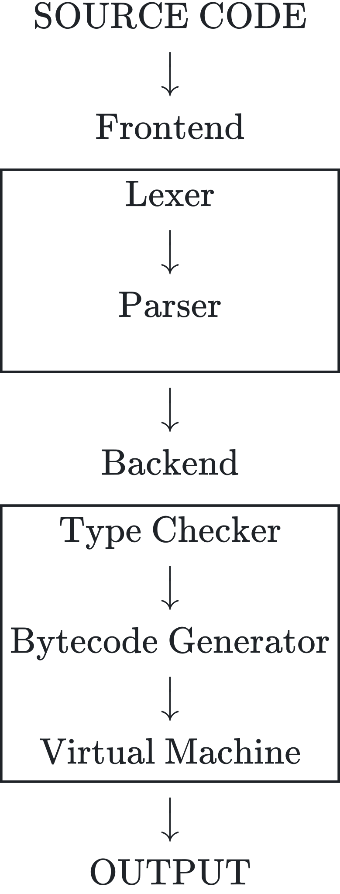
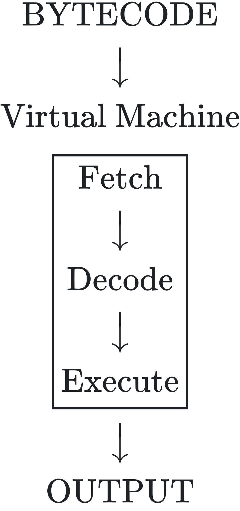

# Bytecode Interpretation From Scratch in C

*4 December 2025*

Last summer, I was learning the C programming language. I liked the low-level control it gave me but I was annoyed by how dense the syntax became when I wrote larger programs. And then I'd switch back to Python which was way more familiar to me, but things felt 'off' because I just missed the safety of static typing in C.

I was essentially caught between those two languages, which led me to think about what I really wanted altogether in one language. And this finally gave me the idea of creating Phase — a statically-typed bytecode-interpreted programming language, designed to combine the expressive syntax of high-level languages (like Python) with the explicit rules of lower-level languages (like C). The name itself, 'Phase', represents an active 'shift' between high- and low-level languages.

And even though there are a lot of compiler tools that already exist (e.g., LLVM, YACC), I chose to do this fully from scratch so I could have full control over everything. Writing the language without any dependencies whatsoever was difficult, but it was worth it because I significantly developed both my programming and thinking skills that way.

## How Phase Works

The Phase interpreter is a big translator. It's split into the frontend, where source code is parsed, and the backend — where that parsed code is executed:

<p align="center">
  <picture>
    <source media="(prefers-color-scheme: dark)" srcset="assets/diagram-pipeline-dark.svg">
    
  </picture>
</p>

Something to note is that while the frontend is necessary for parsing source code into a standard structure, we can do whatever we want with the backend. So for example, if we replaced the entire backend in the diagram with a *code generator*, then Phase would turn from an interpreter into a compiler — converting Phase code into a low-level object or Assembly file. But the type checker is the one component with flexibility in its position, as long as it has an AST to work with — so it can sit anywhere between the parser and backend.

Moving on, I think the best way to explain how Phase actually works is by looking at a small line of code: `out("Hello world!")`. It's just a 'Hello world!' script, but we're using the built-in function `out()` which, unlike `printf()` in C for example, automatically converts the argument type to `string` for convenience — even `true` / `false` booleans. We'll follow this source code through the entire process to understand how each component works — assuming you have some programming knowledge already.

First, **the lexer (or lexical analyzer)**. Here we take in raw source code as an arbitrary character string, and break it down into tokens that represent keywords, operators, types, and literals. These tokens are essentially the building blocks of an executable program because they each represent just one tiny part of our code — and arranging them linearly gives us something much cleaner to work with. So lexing our `out("Hello world!")` code gives us this list of separate tokens here:

```
OUT
LPAREN
STRING_LIT 'Hello world!'
RPAREN
NEWLINE
```

And each of these tokens is implemented as a `struct` in C with members for the token's type (`type`), source (`*lexeme`), location (`line`, `column_start`, `column_end`), and memory usage (`heap_allocated`):

```c
// phase/src/lexer.h

typedef struct {
    TokenType type;  // Enum (e.g., TOK_EOF, TOK_ENTRY)
    char *lexeme;
    int line;          // }
    int column_start;  // }--> We keep the token's exact location
    int column_end;    // }    for info in error messages
    bool heap_allocated;
} Token;
```

Aside from that, the lexer also handles whitespace, distinguishing between keywords and function identifiers, and processing escape sequences in string literals.

Second, **the parser**. This takes the lexer's token stream and constructs an *abstract syntax tree* (or AST) which represents the program's structure with branching nodes. I specifically wrote a recursive-descent parser, where each grammar rule is designated to a specific function which calls another function below — and so on:

```c
// phase/src/parser.c

// We start parsing at the program level, which
// includes newline, function, global, entry,
// and end-of-file (EOF) tokens
AstProgram *parse_program(Parser *parser) {
    // ...
    while (parser->look.type != TOK_EOF) {
        // ...
        if (parser->look.type == TOK_ENTRY) {
            // First call entry parsing
            declaration = parse_entry_decl(parser);
        }
    }
}

static AstDeclaration *parse_entry_decl(Parser *parser) {
    // ...
    // Then call block parsing
    AstBlock *block = parse_block(parser);
}

static AstBlock *parse_block(Parser *parser) {
    // ...
    while (parser->look.type != TOK_RBRACE) {
        // Then call statement parsing, and so on
        // until the branch is fully parsed and
        // we move onto the next
        AstStatement *statement = parse_statement(parser);
    }
}
```

So through this process, our example token stream turns into this AST that finally gives our program a structured form we can easily follow:

```
STATEMENT (OUT)
        ╰ EXPRESSION (STRING) ["Hello world!"]
```

But another thing the parser does is catching syntax errors — for example, forgetting a closing parenthesis in `out("Hello world!"` — by using an important function I wrote to enforce syntax anywhere:

```c
// phase/src/parser.c

static void expect(Parser *parser,
                   TokenType t_type,
                   const char *message) {
    // match() just checks if two
    // enum arguments are equal
    if (!match(parser, t_type)) {
        // If the current token is wrong, we prepare
        // the error message using the location
        // members of the token's struct
        ErrorLocation loc = {
        .file = parser->lexer->file_path,
        .line = parser->look.line,
        .col_start = parser->look.column_start,
        .col_end = parser->look.column_end };

        // Then call the fatal error with
        // all our useful info about it
        error_expect_symbol(loc, message);
    }
}

// So with this function, we easily catch
// missing parentheses when parsing
// a statement like out()
static AstStatement *parse_statement(Parser *parser) {
    // ...
    expect(parser, TOK_LPAREN, "'('");
    AstExpression *expression = parse_expression(parser);
    expect(parser, TOK_RPAREN, "')'");
    // ^ This is what catches our error, since we're
    //   hardcoding the expected right parenthesis
    //   token, plus the character itself for
    //   the error message
}
```

And this would be the error we receive — showing us exactly what was expected, where, and a suggestion for implicitly fixing the issue with the expected token:

```
┏ Fatal Error [102]: Expected ')'.
┃ --> file.phase:2:23-23
┃
┃ 2 |     out("Hello world!"
┃   |                       ^
┃
┣ Help: Add ')' here.
┃ Suggestion:
┃ -     out("Hello world!"
┃ +     out("Hello world!")
```

Third, **the type checker**. This is what makes Phase a statically-typed language, because we check that types are strictly correct in their context so our program doesn't crash when it runs. More specifically, we're validating semantics rather than syntax, which the parser already checked — where syntax would be like arranging words in a sentence, while semantics is having our sentence mean something. So for example, the sentence "colourless green ideas sleep furiously" has correct syntax but wrong semantics because it's complete nonsense.

In practice then, the line `let x: int = "10"` passes fine through the parser, but the type checker sees we're trying to assign a `string` literal to an `int` variable, and raises an error to fix the mismatch.

```
┏ Fatal Error [108]: Type mismatch.
┃ --> file.phase:2:5-14
┃
┃ 2 |     let x: int = "10"
┃   |     ^^^^^^^^^^
┃
┣ Help: Variable 'x' expects int but got str.
┃ Suggestion:
┃ -     let x: int = "10"
┃ +     let x: int = 0
```

And we identify this mismatch with `var_type != expr_type`, where we use `statement->assign.var_name` and `statement->assign.expression` to extract the `TokenType` members from the statement node's components.

Fourth, **the bytecode generator**. Here we compile our AST into a custom instruction set called *bytecode* that works as a compact intermediate representation — making it much easier and faster to execute than directly reading off the AST at runtime.

More specifically, I designed a stack architecture for handling 25 different opcodes in total — where we use the LIFO (last-in, first-out) principle to push the first value in and pop the last value out.

But I want to go deeper into the binary encoding mechanism — ergo, how we generate bytecode itself. For each instruction, we start with an unsigned 1-byte integer `uint8_t` opcode $`c`$, where $`0\mathrm{x}00 \le c \le 0\mathrm{x}18`$, representing a single operation enum like `OP_PRINT` or `OP_HALT`. And if this opcode needs an operand like a literal's constant index, then we add on an unsigned 2-byte integer `uint16_t` in big-endian format.

Big-endian `u16` in particular is a convention that makes things much more convenient. This is because big-endian makes hexadecimal read naturally left-to-right by starting with the high byte (e.g., $`00\;01`$ for first, $`00\;02`$ for second, etc.). I also want to note that literals aren't turned into bytecode so we can keep it as small as possible and reuse values instead of duplicating — which I implemented with constant pooling, where we store all literals in `constants[]` while we use `OP_PUSH_CONST` to extract a literal `Value` from there.

The most important part here is the process for encoding an operand's high byte $`h`$ and low byte $`l`$, where:

```math
h = (n \gg 8) \land 0\mathrm{xFF} \qquad
l = n \mod 256 = n \land 0\mathrm{xFF}
```

When calculating the high byte $`h`$, we shift right by 8 bits $`n \gg 8`$ to move the upper 8 bits into the lowest position (dumping the lower 8 bits) — for example, $`0\mathrm{x1234}`$ becomes $`0\mathrm{x12}`$ — before we apply an $`\text{AND}`$ mask with $`0\mathrm{xFF}`$. This mask clears all bits above the lower 8 bits so we isolate only the original upper byte.

And for the low byte $`l`$, we just mask with $`0\mathrm{xFF}`$ to keep the lower 8 bits of the original 16-bit value, while setting anything above bit 7 to 0. So in practice, this is how we handle binary encoding in the interpreter:

```c
// phase/src/codegen.c

// Emit a single byte for either an opcode
// or part of an operand
static void emit_byte(Emitter *emitter, uint8_t byte) {
    // Check memory space for another byte
    if (emitter->code_len + 1 > emitter->code_cap) {
        // Double our capacity or otherwise
        // set initial to 64 bytes
        size_t new_cap = emitter->code_cap ?
                         emitter->code_cap * 2 : 64;
        // Test the allocation on a pointer
        // acting as an intermediary to
        // prevent memory leaks
        void *temp_ptr = realloc(emitter->code, new_cap);
        if (!temp_ptr) {
            free(emitter->code);
            error_oom();
        }

        // Update our memory and capacity
        emitter->code = temp_ptr;
        emitter->code_cap = new_cap;
    }
    // Add the byte to our sequence
    emitter->code[emitter->code_len++] = byte;
}

// Emit an operand in u16 with
// big-endian formatting
static void emit_u16(Emitter *emitter, size_t value) {
    if (value > UINT16_MAX) error_complexity();
    emit_byte(emitter, (value >> 8) & 0xFF);  // High byte first
    emit_byte(emitter, value & 0xFF);  // Low byte second
}
```

Back to our example code then, we generate a hexadecimal bytecode sequence `00 00 00 01 18` which represents these individual instructions:

```
; Addresses
0x0000  ; u8 opcode + u16 operand, so 0x0000 — 0x0002
0x0003
0x0004

; Bytes
00 00 00  ; Opcode 0x00 with operand 0x0000
01        ; Opcode 0x01
18        ; Opcode 0x18

; Instructions
OP_PUSH_CONST 0  ; Set constants[0] to "Hello world!"
OP_PRINT         ; Pop constants[0] and print
OP_HALT          ; Stop the program
```

Fifth, **the virtual machine**. Here we finally execute our bytecode instructions to produce an output for the source code, which is done through a fetch-decode-execute loop — essentially like a small virtual CPU:

<p align="center">
  <picture>
    <source media="(prefers-color-scheme: dark)" srcset="assets/diagram-vm-dark.svg">
    
  </picture>
</p>

The heart of the interpreter is a single function `interpret()`, where a giant `switch` handles every single opcode in the program and produces an output:

```c
// phase/src/codegen.c

// Reverse of emit_byte(), where we
// read a single byte
static uint8_t read_byte(VM *vm) {
    return vm->code[vm->pos++];
}

// Reverse of emit_u16(), where we
// read an operand's high and low
// bytes and reassemble into one
static uint16_t read_u16(VM *vm) {
    uint16_t high = read_byte(vm);
    uint16_t low = read_byte(vm);

    return (high << 8) | low;
}

void interpret(VM *vm) {
    // Fetch-decode-execute loop
    for (;;) {
        // Check if the instruction pointer
        // pos is out of bounds
        if (vm->pos >= vm->code_len) {
            error_vm_oob((ErrorLocation){0});
        }

        // Fetch an instruction
        Opcode operation = (Opcode)read_byte(vm);

        // Decode the instruction
        switch (operation) {
            // Then execute the instruction, in
            // this case 0x00 that pushes value
            // constants[0] onto the stack
            case OP_PUSH_CONST: {
                // Get the operand
                uint16_t indx = read_u16(vm);
                // Check for invalid indices
                if (indx >= vm->const_count) {
                    error_invalid_const_index((ErrorLocation){0},
                                               vm->const_count);
                }

                // Push the value onto the stack
                push(vm, vm->constants[indx]);
            } break;
            // Instruction 0x01 pops a value
            // from the stack and prints it
            case OP_PRINT: {
                // Get the value from the stack
                Value value = pop(vm);

                // Then we print the value regardless
                // of token type through a chain of
                // conditionals
                if (value.type == VAL_STRING) {
                    printf("%s\n", value.as.str);
                }

                // And so on for integers, floats,
                // booleans, and invalids...
            }
            // ...
            // Instruction 0x18 stops the program
            case OP_HALT: return;
            // ...
        }
    }
}
```

I also want to show how operand decoding with `read_u16()` is just the exact opposite of its encoding counterpart, where the operand $`i`$ is reassembled with the high byte $`h`$ and low byte $`l`$ in a single formula:

```math
i = (h \ll 8) \lor l
```

Here, we left-shift $`h`$ by 8 bits to move it back to its original upper position, before applying an $`\text{OR}`$ mask with $`l`$ to fill its original lower position.

But aside from bytecode, it's important to look at the interpreter stack itself `vm->stack`, a vector of `Value` structs that hold literals:

```c
// phase/src/codegen.h

// Literal items
typedef struct {
    // ValueType is an enum holding
    // the five primitive types
    ValueType type;

    // We use a union to handle
    // each strict type case
    union {
        char *str;
        int integer;
        float floating;
        bool boolean;
    } as;
} Value;

// Virtual machine
typedef struct {
    Value *stack;  // Stack
    // ...
    Value *constants;  // Constant pool
    // ...
    uint8_t *code;  // Bytecode instructions
    // ...
    size_t pos;  // Instruction pointer, signifying
                 // our position going through
                 // the bytecode instructions
    // ...
} VM;
```

And with this structure, we can look at the essential `push()` / `pop()` functions that handle all stack operations:

```c
// phase/src/codegen.c

static void push(VM *vm, Value value) {
    // Check memory space for another value
    if (vm->stack_count + 1 > vm->stack_cap) {
        // Double our capacity or otherwise
        // set initial to 8 bytes
        size_t new_cap = vm->stack_cap ? vm->stack_cap * 2 : 8;
        // Sanitize reallocation
        void *temp_ptr = realloc(vm->stack,
                                 new_cap * sizeof(Value));
        if (!temp_ptr) {
            free(vm->stack);
            error_oom();
        }

        // Update memory and cap
        vm->stack = temp_ptr;
        vm->stack_cap = new_cap;
    }
    // Append the value to the end of the stack
    vm->stack[vm->stack_count++] = value;
}

static Value pop(VM *vm) {
    // Extract the latest value in the stack
    return vm->stack[--vm->stack_count];
}
```

Tracing our bytecode sequence `00 00 00 01 18` through the VM, opcode `0x00` (`OP_PUSH_CONST`) pushes `constants[0]`, then opcode `0x01` (`OP_PRINT`) pops the value, and opcode `0x18` (`OP_HALT`) stops the program — giving us our final output for `out("Hello world!")`:

```
Hello world!
```

## Implementation Choices & Tradeoffs

Now I want to go through some important decisions and tradeoffs I made during development.

First, **Interpreter versus transpiler.** Originally, Phase was meant to be a transpiler that converted source code to C code, which was actually the first working version of Phase that I wrote. But as I started to test my first programs, the build-run pipeline was so tedious that I had to replace the backend's code generator with an interpreter, even though I was planning to show more low-level knowledge via the transpiler.

Second, **Static typing versus dynamic typing.** Static typing makes things harder because you have to implement type checking and more sophisticated error handling, but it's worth it with bug-catching and explicitness in code. I originally implemented C-style variable type declarations because they were simple and I was used to them — but after some feedback from a person online, I replaced them with Rust-style declarations to future-proof parsing.

Third, **Stack-based VM versus register-based VM.** I designed a stack-based architecture because it's much simpler to implement — and while it's slower because of more stack operations, there wouldn't be any noticeable difference between the two architectures for a language this small.

Fourth, **Python versus C.** I created the first prototype of Phase (called Luma then) in Python since I was much more familiar with it than C, and I got it working in a few days with some very basic features. But writing it in Python made me feel as if I were cheating in a way, so I challenged myself to write it in C to speed up my learning by forcing me to confront everything I didn't know about.

## Reflections

Phase was my very first serious and polished long-term project. It has enough features as a programming language to let you write various programs, like this Fibonacci sequence generator:

```
-- We define the function with integer
-- parameter n and return type void
func fibonacci(n: int): void {
    -- Tuple destructuring lets us initialize
    -- variables as groups in one line
    let (a, b): int = (0, 1)
    let (next, count): int = (b, 1)

    while count <= n {
        out(next)
        count += 1
        next = a + b
        a = b
        b = next
    }
}

-- Program starts here with a keyword instead
-- of the usual main() function to signify
-- the entry point
entry {
    fibonacci(10)
}

-- 1, 1, 2, 3, 5, 8, 13, 21, 34, 55
```

The whole project took me roughly two months of planning, three months of programming, then a month of polishing until releasing v1.0.0 on GitHub. And since this was my first serious project, I actually learned many things not just about programming but projects themselves — so research, planning, tradeoffs, thinking about UX, and even documentation like this writing here.

But I'd say the most important thing I learned was how to surgically scope my work, which gave me specific targets with specific steps rather than some vague ambitions. And since this let me write the whole project myself, I learned so much more than if I hadn't actually made it — which is why I value project-based learning over anything else.

[github.com/williamalexakis/phase](https://github.com/williamalexakis/phase)
