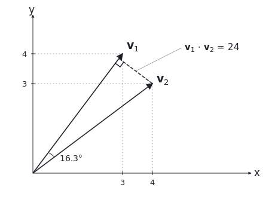
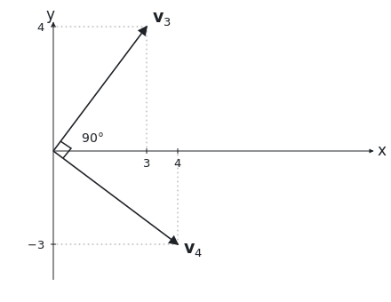
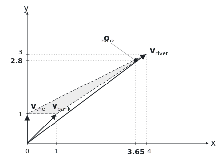

# Self-Attention, From First Principles

*11 June 2026*

Large language models (LLMs) like ChatGPT, Claude, etc. have by now cemented themselves in our everyday lives. But most people still don't know how LLMs work — mostly because of the lack of education about AI and because companies are annoyingly focused on proprietary consumerism which hides even more about how this stuff works.
I won't focus much on AI literacy, but it's a big reason for this essay. People misusing AI by treating it like a glorified aearch engine or thinking it's alive both stem from the fact that many just don't know that an LLM — at its core — is just maths, and specifically a concept called *attention*.

This concept of attention was introduced in Google's 2017 paper, [Attention Is All You Need](https://arxiv.org/pdf/1706.03762), and I'll go over how it works here — assuming you know some linear algebra but don't know how this specifically works.

For each token processed, we look at every previous token (including itself) in the sequence and calculate how relevant each one is to our current token — then pull info from them based on their attention weights, letting us build associations between individual tokens. A very basic example would be that when we process the token "bank" in "the river bank", it's meaningless by itself, but the attention mechanism lets the trained model strongly associate it with the token "river".

The transformer doesn't actually 'know' what those "river" or "bank" tokens mean because this is all just maths. Before attention, the input token embeddings $`\mathbf{X}`$ are put through three learned linear projections:

```math
\mathbf{Q} = \mathbf{X} \mathbf{W}_Q \qquad
\mathbf{K} = \mathbf{X} \mathbf{W}_K \qquad
\mathbf{V} = \mathbf{X} \mathbf{W}_V
```

The weight matrices $`\mathbf{W}_Q`$, $`\mathbf{W}_K`$, and $`\mathbf{W}_V`$ are what the model learns in pre-training, and we use them to create three vectors $`\mathbf{Q}`$, $`\mathbf{K}`$, and $`\mathbf{V}`$ for each token. $`\mathbf{Q}`$ is the token's query of what it's looking for, $`\mathbf{K}`$ is the token's key of what it contains, and $`\mathbf{V}`$ is the token's value of what it contributes to the output. These vectors are what actually lets statistical associations form — so knowing that, we can look at the attention formula itself:

```math
\text{Attention}(\mathbf{Q}, \mathbf{K}, \mathbf{V}) = \text{softmax}\left(\frac{\mathbf{Q}\mathbf{K}^\top}{\sqrt{d_k}}\right)\mathbf{V}
```

In the equation, we get an attention score by dotting $`\mathbf{Q}`$ with the transposed key $`\mathbf{K}^\top`$, then divide the score by $`\sqrt{d_k}`$ (where $`d_k`$ is the shared dimension of each $`\mathbf{Q}`$ and $`\mathbf{K}`$ vector), run it through $`\text{softmax}()`$ to produce an attention weight $`W`$, and multiply by $`\mathbf{V}`$ to get our output. The dot product works as a relevance score because the dot product of two vectors actually has a geometric identity, where $`\theta`$ is the angle between vectors $`\mathbf{q}`$ and $`\mathbf{k}`$:

```math
\mathbf{q} \cdot \mathbf{k} = |\mathbf{q}||\mathbf{k}|\cos\theta
```

Here, we're using directional alignment to denote how closely related two vectors are. So when $`\theta`$ is small, $`\cos\theta`$ approaches $`1`$ with a large dot product, meaning the vectors are pointing in similar directions (related). But when $`\theta = 90^{\circ}`$, then $`\cos\theta = 0`$, meaning the vectors are perpendicular (unrelated). Basically the dot product measures how closely aligned two vectors are; a closer alignment means a larger dot product — and a larger dot product is a higher relevance score. In practice, here's what this looks like for a pair of $`2`$-dimensional vectors $`\mathbf{v}_1`$ and $`\mathbf{v}_2`$:

```math
\mathbf{v}_1 = \begin{pmatrix} 3 \\ 4 \end{pmatrix} \qquad
\mathbf{v}_2 = \begin{pmatrix} 4 \\ 3 \end{pmatrix}
```

We first compute magnitude:

```math
|\mathbf{v}_1| = |\mathbf{v}_2| = \sqrt{3^2 + 4^2} = 5
```

They both have the same magnitude of $`5`$, which means the only difference is their direction. We then compute the dot product:

```math
\begin{aligned}
\mathbf{v}_1 \cdot \mathbf{v}_2 &= (3 \times 4) + (4 \times 3) \\
&= 12 + 12 \\
&= 24
\end{aligned}
```

A dot product of $`24`$ is large which means high relevance, and we can see this by calculating the angle $`\theta`$ between the two vectors:

```math
\begin{aligned}
\theta &= \cos^{-1}\left(\frac{\mathbf{v}_1 \cdot \mathbf{v}_2}{|\mathbf{v}_1||\mathbf{v}_2|}\right) \\
&= \cos^{-1}\left(\frac{24}{5 \times 5}\right) \\
&\approx 16.3^{\circ}
\end{aligned}
```

With this, we know that the vectors have close directional alignment, which is why they are relevant to each other. On a graph their relationship looks like this:

<p align="center">
  <picture>
    <source media="(prefers-color-scheme: dark)" srcset="assets/fig1-related-dark.svg">
    
  </picture>
</p>

But now here's what the process looks like for two *unrelated* vectors $`\mathbf{v}_3`$ and $`\mathbf{v}_4`$ which also have an equal magnitude of $`5`$:

```math
\mathbf{v}_3 = \begin{pmatrix} 3 \\ 4 \end{pmatrix} \qquad
\mathbf{v}_4 = \begin{pmatrix} 4 \\ -3 \end{pmatrix}
```

```math
\begin{aligned}
\mathbf{v}_3 \cdot \mathbf{v}_4 &= (3 \times 4) + (4 \times -3) \\
&= 12 + (-12) \\
&= 0
\end{aligned}
```

```math
\begin{aligned}
\theta &= \cos^{-1}\left(\frac{\mathbf{v}_3 \cdot \mathbf{v}_4}{|\mathbf{v}_3||\mathbf{v}_4|}\right) \\
&= \cos^{-1}\left(\frac{0}{5 \times 5}\right) \\
&= 90^{\circ}
\end{aligned}
```

With a dot product of $`0`$ and an angle of $`90^{\circ}`$, our vectors are orthogonal — meaning they're perpendicular and unrelated to each other:

<p align="center">
  <picture>
    <source media="(prefers-color-scheme: dark)" srcset="assets/fig2-orthogonal-dark.svg">
    
  </picture>
</p>

Now, the actual reason that directional alignment means relevance is because $`\mathbf{W}_Q`$ projects each token's embedding into a $`d_k`$-dimensional space where the direction of the vector means the query of "what I'm looking for". Meanwhile $`\mathbf{W}_K`$ projects into the same space where the direction means the key of "what I contain". So you see that the model trained these weight matrices to make tokens that should correlate end up pointing in similar directions in that shared space — where, for example, $`\mathbf{q}_{\text{bank}}`$ in our example sentence points roughly where $`\mathbf{k}_{\text{river}}`$ also points to. Through training, the model already learns these alignments between tokens, but we use the dot product during inference to actually measure those alignments.

Moving on, $`\text{softmax}()`$ is an important function because it emphasizes differences between raw attention scores through exponentiation, normalizes to $`1`$, and leaves us with a probability distribution of attention weights:

```math
\text{softmax}(z_i) = \frac{e^{z_i}}{\sum_{j=1}^{n} e^{z_j}}
```

Another very important thing is dividing the score by $`\sqrt{d_k}`$ to normalize before $`\text{softmax}()`$ because the raw attention score is the dot product $`\mathbf{q} \cdot \mathbf{k}`$. After initialization, the $`d_k`$ components of each query vector $`\mathbf{q}`$ and key vector $`\mathbf{k}`$ are roughly independent with $`\text{mean} = 0`$ and $`\text{variance} \approx 1`$. And since the components are independent, then $`\text{variance}(\mathbf{q}\cdot\mathbf{k}) = \sum_i \text{variance}(q_i k_i)`$ , which just equals $`d_k`$, so the score's typical magnitude is $`\sqrt{d_k}`$. This means that by around $`d_k \ge 25`$, the score grows so large that it saturates $`\text{softmax}()`$ and kills the probability gradient, leaving us with only one dominant value while everything else is negligible.

Back to our example then — what actually happens is query $`\mathbf{q}_{\text{bank}}`$ is dotted with keys $`\mathbf{k}_{\text{the}}`$, $`\mathbf{k}_{\text{river}}`$, and $`\mathbf{k}_{\text{bank}}`$ to produce three attention scores. These are run through $`\text{softmax}()`$ to produce a distribution of positive attention weights that sum to $`1`$, where "river" is the largest value — so it's the heaviest weight. Then, our output $`\mathbf{o}_{\text{bank}}`$ is a weighted sum of all values, where the $`w`$'s are the $`\text{softmax}()`$ weights:

```math
\mathbf{o}_{\text{bank}} = w_\text{the} \cdot \mathbf{v}_{\text{the}} + w_\text{river} \cdot \mathbf{v}_{\text{river}} + w_\text{bank} \cdot \mathbf{v}_{\text{bank}}
```

Token "river" dominates here because its weight is much larger which dilutes the other weights, and the output we generate is a point in embedding space that's been dragged closer to $`\mathbf{v}_{\text{river}}`$ by the weight distribution. That's why there's no discrete selection here like 'choosing' a token; attention is a dynamic mechanism, and whichever vector has dominant weight just pulls the output closer to itself.

For example, using $`2`$-dimensional vectors to keep things simple, this is what the process looks like where we have token values:

```math
\mathbf{v}_{\text{the}} = \begin{pmatrix} 0 \\ 1 \end{pmatrix} \qquad
\mathbf{v}_{\text{river}} = \begin{pmatrix} 4 \\ 3 \end{pmatrix} \qquad
\mathbf{v}_{\text{bank}} = \begin{pmatrix} 1 \\ 1 \end{pmatrix}
```

And we have $`\text{softmax}()`$ attention weights:

```math
w_{\text{the}} = 0.05 \qquad
w_{\text{river}} = 0.90 \qquad
w_{\text{bank}} = 0.05
```

We multiply all of this stuff and sum it up:

```math
\begin{aligned}
\mathbf{o}_{\text{bank}} &= 0.05\begin{pmatrix} 0 \\ 1 \end{pmatrix} + 0.90\begin{pmatrix} 4 \\ 3 \end{pmatrix} + 0.05\begin{pmatrix} 1 \\ 1 \end{pmatrix} \\
&= \begin{pmatrix} 0 \\ 0.05 \end{pmatrix} + \begin{pmatrix} 3.6 \\ 2.7 \end{pmatrix} + \begin{pmatrix} 0.05 \\ 0.05 \end{pmatrix} \\
&= \begin{pmatrix} 3.65 \\ 2.8 \end{pmatrix}
\end{aligned}
```

So you see how $`\mathbf{o}_{\text{bank}}`$ aligns closely with $`\mathbf{v}_{\text{river}}`$ but it's not exactly equal, because it's a weighted sum of all values including $`\mathbf{v}_{\text{the}}`$ and $`\mathbf{v}_{\text{bank}}`$. It's easier to see on a graph how our output is dragged towards the heaviest weighted value — but keep in mind that while this is $`2`$-dimensional, real value vectors exist in much higher $`d_k`$-dimensional spaces:

<p align="center">
  <picture>
    <source media="(prefers-color-scheme: dark)" srcset="assets/fig3-output-dark.svg">
    
  </picture>
</p>

And with that, we've gone all the way from "the river bank" — where "river" and "bank" have nothing to do with each other by themselves — to proving exactly how "bank" is related to "river" with the maths behind *self-attention*. Now this is just one part of LLMs overall, but it's the one system that I'd say is actually worth taking your time to understand.

I think it's really important to demistify widespread technology like this because it lets us know exactly what this type of product *can do*, past the brands and marketing. Now obviously not everyone needs to be forcefed self-attention derivations, but some abstract teaching would still be useful I'd say. Again, the point of tech literacy is to prevent stuff like bosses replacing employees with agents and students depending on AI — all just from not knowing what LLMs really are.

Anyways, I also wanna mention that another reason for writing this essay is for *me* to learn about attention. It's a sort of trial-by-fire learning method, where by having to explain the concept in my own words then I have to internalize it as well — for example, every word or concept I wrote that I didn't fully understand, I researched it and wrote in the explanation itself for the *how* and *why* of something.

So apart from AI literacy, another takeaway would be that if you really want to learn something, don't just read a bunch of boring papers but try to teach it in your own words until you learn it yourself, and then you end up with both learning something new and hard proof you know it as well.

[github.com/williamalexakis/self-attention.c](https://github.com/williamalexakis/self-attention.c)
